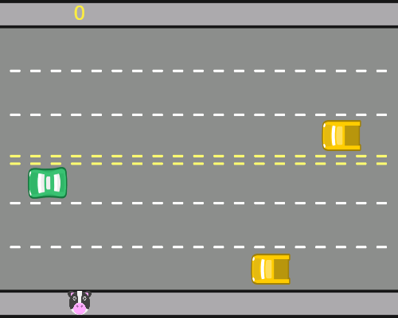

<h1> Jogo_freeway </h1>

Jogo freeway desenvolvido durante a formação na plataforma alura.

 1. O objetivo do jogo é que a personagem vaca atravesse a estrada e chegue ao outro lado. 

 2. O jogo conta com sistema de pontuação que ao atravessar a estrada o jogador marcará um ponto, mas colisão com os carros remove um ponto e devolve o personagem ao início. 

 3. Está integrado ao jogo uma trilha sonora, som de pontuação e de colisão. 
